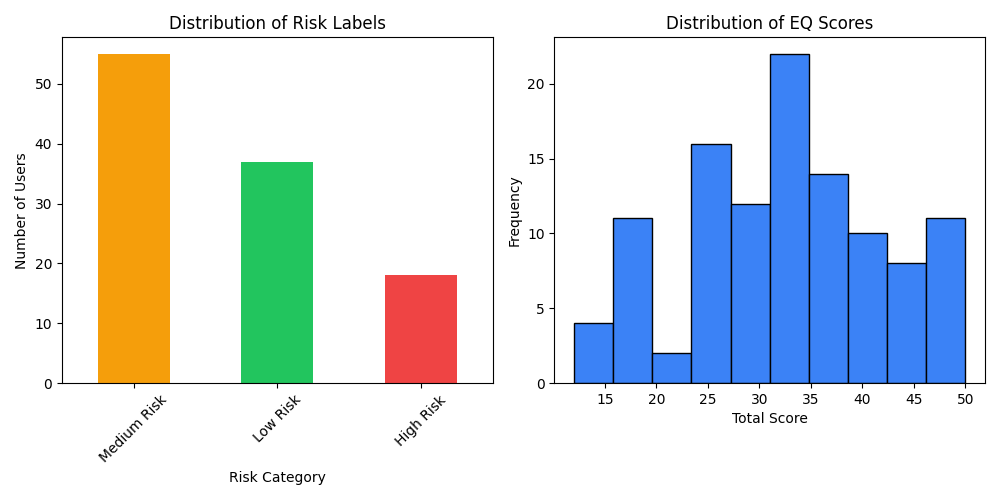

# 🧠 Soul Sense EQ Test

Soul Sense EQ Test is a desktop-based Emotional Intelligence (EQ) assessment application built using Python, Tkinter, and SQLite.
It provides a ✅ Tip: If you see `ModuleNotFoundError`, it usually means your virtual environment is **not active** or the package isn't installed inside it.

---

## 🌍 Multi-language Support

SoulSense now supports multiple languages with easy switching!

### Supported Languages

- **English** (default)
- **हिंदी (Hindi)**
- **Español (Spanish)**

### Quick Start

1. Launch the application
2. Select your language from the dropdown at the top of the main screen
3. All UI elements update instantly
4. Your preference is saved automatically

### For Contributors

Want to add your language? See our [I18N Guide](I18N_GUIDE.md) for:

- Step-by-step instructions
- Translation template
- Testing guidelines

<div align="center">

# Frequently Asked Questions

Everything you need to know about the **Soul Sense Exam**.

</div>

<table>
<tr>
<td width="65%" valign="top">

<h3>User FAQs</h3>

<details>
<summary><strong>Is this a medical or diagnostic test?</strong></summary>
<br>
No. This application is not a medical or psychological diagnostic tool. It is meant for self-reflection and educational purposes only.
</details>

<details>
<summary><strong>Are my responses stored?</strong></summary>
<br>
User responses may be stored securely to improve insights and future features. Personal data is handled responsibly and with user consent.
</details>

<details>
<summary><strong>Can I retake the exam?</strong></summary>
<br>
Yes, users can retake the exam to track changes in their emotional patterns over time.
</details>

<details>
<summary><strong>How are the results calculated?</strong></summary>
<br>
Results are generated based on predefined logic and, in future updates, may use data-driven or ML-based analysis.
</details>

<details>
<summary><strong>Can I edit my personal details later?</strong></summary>
<br>
Yes, users will be able to update their profile information as new features are added.
</details>

<details>
<summary><strong>Will this app give therapy or treatment advice?</strong></summary>
<br>
No. The app may provide general insights or suggestions, but it does not replace professional help.
</details>

<details>
<summary><strong>Is my data shared with others?</strong></summary>
<br>
No personal data is shared without consent. Any data used for analysis is anonymized.
</details>

<details>
<summary><strong>Who should I contact for support or feedback?</strong></summary>
<br>
You can raise an issue on the GitHub repository or contact the project maintainers through the community channels.
</details>

<br>
<hr>
<h3>Contributor FAQs</h3>

<details>
<summary><strong>How do I run this project locally?</strong></summary>
<br>
Clone the repo, set up a virtual environment (<code>python -m venv venv</code>), install dependencies with <code>pip install -r requirements.txt</code>, and run <code>python -m app.main</code> to launch the application.
</details>

<details>
<summary><strong>What is the Tech Stack?</strong></summary>
<br>
This project utilizes Python 3.11+, Tkinter for the GUI, SQLite for the database, and Pytest for testing.
</details>

<details>
<summary><strong>Found a bug?</strong></summary>
<br>
Please open an issue describing the bug, steps to reproduce it, and the expected behavior. Pull Requests with fixes are welcome!
</details>

</td>
<td width="35%" valign="top" align="center">

<br>


</td>
</tr>
</table>

---

## 🔐 Admin Interface

SoulSense includes a powerful admin interface for managing questions and categories.

### Features

- **GUI Admin Panel** - User-friendly graphical interface
- **CLI Tool** - Command-line interface for automation
- **Secure Access** - Password-protected admin accounts
- **CRUD Operations** - Create, Read, Update, Delete questions
- **Category Management** - Organize questions by category
- **Metadata Support** - Age range, difficulty, weight customization

### Quick Start

**Create Admin Account:**

```bash
python admin_cli.py create-admin --no-auth
```

**Launch GUI:**

```bash
python admin_interface.py
```

**CLI Commands:**

```bash
python admin_cli.py list                    # List all questions
python admin_cli.py add                     # Add new question
python admin_cli.py view --id 1             # View question
python admin_cli.py update --id 1           # Update question
python admin_cli.py delete --id 1           # Delete question
python admin_cli.py categories              # View statistics
```

### Documentation

See [ADMIN_GUIDE.md](ADMIN_GUIDE.md) for comprehensive documentation.

---

## ▶️ How to Runeractive self-reflection test, persists results locally, and is designed with maintainability, testability, and extensibility in mind.

**🌍 Now available in multiple languages: English, Hindi (हिंदी), and Spanish (Español)!**

The application is grounded in established emotional intelligence theory (Salovey & Mayer, 1990; Goleman, 1995) and incorporates evidence-based approaches for self-report EI assessment (Petrides & Furnham, 2001). For comprehensive academic references, see [RESEARCH_REFERENCES.md](RESEARCH_REFERENCES.md).

---

## ✨ Features

- **🌐 Multi-language Support (NEW!)**
  - English, Hindi, and Spanish translations
  - Easy language switching from the UI
  - Persistent language preferences
  - Simple framework for adding more languages
- **User Authentication System**
  - Secure user registration and login
  - Password hashing with SHA-256
  - Session management with logout functionality
  - User-specific data tracking
- **Outlier Detection & Data Quality**
  - Statistical outlier detection using multiple methods (Z-score, IQR, MAD, Modified Z-score)
  - Ensemble outlier detection with consensus voting
  - Inconsistency pattern detection for users
  - Age-group and global analysis capabilities
  - Comprehensive data quality reporting
- Interactive Tkinter-based GUI
- SQLite-backed persistence for questions, responses, and scores
- Questions loaded once into the database, then read-only at runtime
- Automatic EQ score calculation with interpretation
- Stores:
  - Per-question responses
  - Final EQ score
  - Optional age and age group
  - User authentication data
- Backward-compatible database schema migrations
- Pytest-based test suite with isolated temporary databases
- Daily emotional journal with AI sentiment analysis
- Emotional pattern tracking and insights
- View past journal entries and emotional journey

---

## 📝 Journal Feature

The journal feature allows users to:

- Write daily emotional reflections
- Get AI-powered sentiment analysis of entries
- Track emotional patterns over time
- View past entries and emotional journey
- Receive insights on stress indicators, growth mindset, and self-reflection

**AI Analysis Capabilities:**

- **Sentiment Scoring:** Analyzes positive/negative emotional tone using NLTK's VADER
- **Pattern Detection:** Identifies stress indicators, relationship focus, growth mindset, and self-reflection
- **Emotional Tracking:** Monitors emotional trends over time

The journal feature is informed by research on expressive writing and emotional processing (Pennebaker, 1997; Smyth, 1998), which demonstrates the therapeutic benefits of written emotional expression. The AI sentiment analysis uses natural language processing techniques validated in computational psychology research (Calvo & D'Mello, 2010).

---

## 🤖 ML Model Training (Real User Data)

Soul Sense now supports training a custom Machine Learning model on **real local user data** to provide personalized risk assessments.

### How It Works

1.  **Data Collection**: As users take tests and write journals, data accumulates in `db/soulsense.db`.
2.  **Threshold**: The system requires at least **100 records** to ensure statistical validity.
3.  **Training**: The `train_real_model.py` script extracts this data, labels it based on risk factors (Score + Sentiment), and trains a Random Forest model.
4.  **Inference**: The app automatically uses the latest trained model for future predictions.

### Command to Train

```bash
python scripts/train_real_model.py
```

_Note: If you have fewer than 100 records, the script will abort to prevent overfitting._

### 📊 Data Distribution

The following chart emphasizes the quantity of data points across risk categories and score ranges used for training:



---

## 🧠 Sentiment Analysis Integration

### Overview

Soul Sense integrates **NLTK's VADER (Valence Aware Dictionary and sEntiment Reasoner)** sentiment analysis into both the EQ test and journal features, providing a more comprehensive understanding of users' emotional states.

### How It Helps Users

#### 1. **Captures Emotional Context Beyond Multiple Choice**

- MCQ questions only capture structured responses (Never/Sometimes/Often/Always)
- Open-ended reflection reveals **actual emotional state** in the user's own words
- Detects disconnect between quantitative scores and qualitative feelings

#### 2. **More Nuanced Risk Assessment**

The AI Analysis considers:

- **Quantitative data**: EQ scores (structured responses)
- **Qualitative data**: Sentiment score from written reflection (-100 to +100)

This dual analysis provides insights like:

- `High EQ + Negative Sentiment` = Good skills but currently struggling
- `Low EQ + Positive Sentiment` = Room for growth but good emotional resilience

#### 3. **Personalized Recommendations**

Based on sentiment ranges:

- **Negative (-20 to -100)**: Suggests journaling, professional support, stress management
- **Neutral (-20 to +20)**: Encourages continued practice
- **Positive (+20 to +100)**: Reinforces strengths, suggests mentorship

#### 4. **Validation & Empathy**

- Users feel heard when their written reflection is analyzed
- System acknowledges current emotional state
- Creates more human interaction vs. just numbers

### Technical Implementation

**VADER Features:**

- ✅ Understands negation: "I am NOT happy" → negative
- ✅ Detects intensity: "devastatingly sad" vs. "a bit sad"
- ✅ Works on casual, everyday language
- ✅ Real-time analysis with no external API calls

### Where Results Are Shown

1. **Results Dashboard**: Displays sentiment score alongside EQ score
2. **AI Analysis Popup**: Comprehensive analysis with:
   - Risk level and confidence
   - Sentiment score interpretation
   - Top influencing factors
   - Personalized recommendations based on both EQ and sentiment
3. **Journal Analytics**: Tracks sentiment trends over time (when using Daily Journal)

---

## 🛠 Technologies Used

- Python 3.11+
- Tkinter (GUI)
- SQLite3 (Database)
- Pytest (Testing)

---

## 📂 Project Structure (Refactored)

```bash
SOUL_SENSE_EXAM/
│
├── app/                     # Core application package
│   ├── ml/                  # Machine Learning modules
│   │   ├── __init__.py
│   │   ├── predictor.py
│   │   ├── clustering.py
│   │   └── ...
│   ├── ui/                  # UI components
│   │   ├── dashboard.py
│   │   ├── journal.py
│   │   └── ...
│   ├── main.py              # Tkinter application entry point
│   ├── config.py            # Centralized configuration
│   ├── db.py                # Database connection & migrations
│   ├── i18n_manager.py      # Internationalization
│   └── ...
│
├── data/                    # persistent data
│   ├── soulsense.db         # SQLite database
│   ├── questions.txt        # Source question bank
│   └── experiments/         # ML experiments
│
├── models/                  # ML models & registry
│   ├── soulsense_ml_model.pkl
│   └── registry/
│
├── logs/
│   └── soulsense.log        # Application logs
│
├── scripts/                 # Maintenance scripts
├── tests/                   # Pytest test suite
├── migrations/              # Alembic migrations
│
├── alembic.ini              # Alembic config
├── pytest.ini               # Pytest config
├── requirements.txt         # Dependencies
└── README.md
```

---

## 🧩 Question Format

Each question is rated on a 4-point Likert scale:

- Never (1)
- Sometimes (2)
- Often (3)
- Always (4)

### Sample Questions

- You can recognize your emotions as they happen.
- You adapt well to changing situations.
- You actively listen to others when they speak.

---

## 🐍 Setting Up a Virtual Environment & Installing Packages

It’s recommended to use a **virtual environment** to keep your project dependencies isolated from your system Python.

1️⃣ Create a Virtual Environment  
From your project root directory:

```bash
python -m venv venv
```

This will create a `venv/` folder inside your project.

2️⃣ Activate the Virtual Environment

Windows:

```bash
venv\Scripts\activate
```

macOS/Linux:

```bash
source venv/bin/activate
```

When active, your terminal prompt will show `(venv)`.

3️⃣ Install Required Packages

Once activated, install your project dependencies:

```bash
pip install -r requirements.txt
```

<!--4️⃣ Save Dependencies (Optional but Recommended)

Freeze installed packages to a `requirements.txt` file:
pip freeze > requirements.txt

Later, to replicate the environment on another machine:
pip install -r requirements.txt -->

> Always **activate the virtual environment** before running scripts or installing new packages.

✅ Tip: If you see `ModuleNotFoundError`, it usually means your virtual environment is **not active** or the package isn’t installed inside it.

---

## ▶️ How to Run

### 1. Database Setup

Ensure your database schema is up to date:

```bash
python -m alembic upgrade head
```

### 2. Start the Application

Launch the SoulSense interface:

```bash
python -m app.main
```

## 🛠️ Troubleshooting & Developer Notes

### Common Issues & Fixes

1.  **"Failed to fetch questions from DB" / `KeyError: min_age`**

    - **Cause**: Database schema is outdated (missing columns in `QuestionCache`).
    - **Fix**: Run migration or reset database:
      ```bash
      python -m scripts.fix_db
      python -m scripts.load_questions
      ```

2.  **`ImportError: cannot import name 'get_session' from 'app.models'`**

    - **Fix**: This project strictly separates DB connection logic (`app.db`) from models (`app.models`). Ensure you import `get_session` from `app.db`.

3.  **Application Freeze on Startup**

    - **Cause**: Matplotlib trying to use an interactive backend (TkAgg) conflicting with Tkinter main loop.
    - **Fix**: Ensure `matplotlib.use('Agg')` is called _before_ importing `pyplot`.

4.  **`ObjectNotExecutableError`**
    - **Cause**: SQLAlchemy 2.0+ requires raw SQL to be wrapped in `text()`.
    - **Fix**: Use `from sqlalchemy import text` and wrap strings: `connection.execute(text("SELECT ..."))`.

### For Contributors

- Always install new dependencies via `pip install -r requirements.txt`.
- If you change the database models, generate a migration: `python -m alembic revision --autogenerate -m "message"`.
- This project uses **SQLAlchemy 2.0** syntax. Avoid legacy query patterns.

> **Note:** Do not use `npm run dev`. This is a pure Python application.

**Authentication Flow:**

1. **First-time users:** Click "Sign Up" to create an account

   - Choose a username (minimum 3 characters)
   - Set a password (minimum 4 characters)
   - Confirm your password

2. **Returning users:** Enter your username and password to login

3. **During the test:** Use the logout button to switch users or exit securely

**Security Features:**

- Passwords are hashed using SHA-256 encryption
- User sessions are managed securely
- Each user's data is isolated and protected

---

## 🧪 Automated Testing & CI/CD

We maintain a comprehensive test suite to ensure application stability.

### 1. Running Tests Locally

Run the full test suite with:

```bash
python -m pytest tests/ -v
```

This executes:

- **Unit Tests**: Verifies UI logic (auth, exam flow) using mocks.
- **Integration Tests**: Verifies database schemas and clustering logic.
- **Migration Tests**: Verifies `alembic upgrade head` works on a fresh DB.

### 2. Continuous Integration (GitHub Actions)

This project uses **GitHub Actions** for CI. Every push to `main` or Pull Request triggers:

- **Linting**: `flake8` checks for code style issues.
- **Testing**: `pytest` runs the full suite in a headless environment.

Configuration file: `.github/workflows/python-app.yml`

### 3. Database Migrations

We use **Alembic** for safe database schema updates.

**Apply Migrations:**

```bash
python -m alembic upgrade head
```

**Create New Migration (after modifying models):**

```bash
python -m alembic revision --autogenerate -m "describe_change"
```

**Verify Migrations:**
Our test suite includes `tests/test_migrations.py` which guarantees that migrations apply correctly to a fresh database.

---

## 📊 Outlier Detection Features

### Overview

The outlier detection module identifies extreme or inconsistent emotional intelligence scores using advanced statistical methods.

**Supported Methods:**

- **Z-Score**: Identifies scores deviating significantly from mean
- **IQR (Interquartile Range)**: Robust method for skewed distributions
- **Modified Z-Score**: Uses median/MAD for robustness
- **MAD (Median Absolute Deviation)**: Resistant to extreme values
- **Ensemble**: Consensus-based approach combining multiple methods

### Command Line Usage

```bash
# Analyze user scores
python scripts/outlier_analysis.py --user john_doe --method ensemble

# Analyze age group
python scripts/outlier_analysis.py --age-group "18-25" --method iqr

# Global analysis
python scripts/outlier_analysis.py --global --method zscore

# Check inconsistency patterns
python scripts/outlier_analysis.py --inconsistency john_doe --days 30

# Get statistics
python scripts/outlier_analysis.py --stats --age-group "26-35"

# Output as JSON
python scripts/outlier_analysis.py --user john_doe --format json
```

### Python API

```python
from app.db import get_session
from app.analysis.outlier_detection import OutlierDetector

detector = OutlierDetector()
session = get_session()

# Detect outliers for user
result = detector.detect_outliers_for_user(session, "john_doe", method="ensemble")

# Detect by age group
result = detector.detect_outliers_by_age_group(session, "18-25", method="iqr")

# Global analysis
result = detector.detect_outliers_global(session, method="zscore")

# Inconsistency analysis
result = detector.detect_inconsistency_patterns(session, "john_doe", time_window_days=30)
```

---

## 🧱 Design Notes

- Database schemas are created and migrated safely at runtime
- Question loading is idempotent and separated from application logic
- Core logic is decoupled from the GUI to enable testing
- Outlier detection uses NumPy for efficient statistical computations
- All methods are fully tested with comprehensive edge case coverage

---

## 📌 Status

- Refactor complete
- Tests added
- Stable baseline for further enhancements (e.g., decorators, generators)

## 🤝 Contributing

We welcome contributions from the community.  
Please read our [Code of Conduct](CODE_OF_CONDUCT.md) before contributing to help maintain a respectful and inclusive environment.
